# 实验报告

## 使用https绑定证书到域名

#### 1. 使用openssl生成自签发的PKI X.509证书
- 安装pyOpenSSL
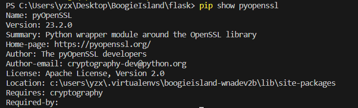
- 创建虚构CA，生成**根CA证书**：
    - 在bash中使用``openssl genrsa -des3 -out ca.key 2048``命令生成CA私钥。
    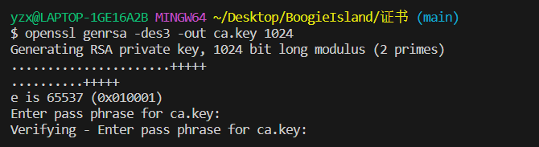
    - 使用``openssl req -new -x509 -key ca.key -out ca.crt -days 365``生成根CA证书。
    其中，``-x509``指生成自签名证书，``-days 365``指证书有效期限为365天。
    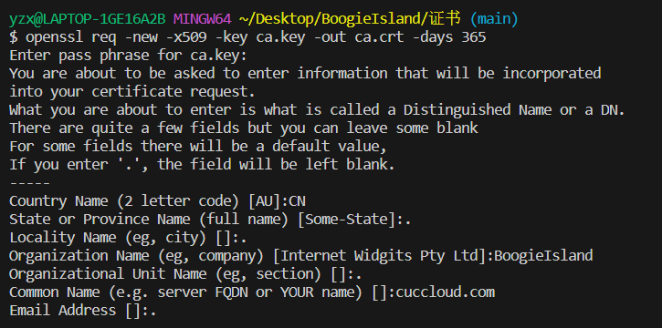
- 生成网站的证书签名请求文件：
    - 使用``openssl genrsa -des3 -out server.key 2048``命令生成私钥。
    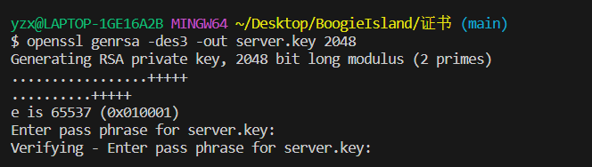
    - 使用``openssl req -new -key server.key -out server.csr``命令生成网站证书签名请求文件(.csr)。
    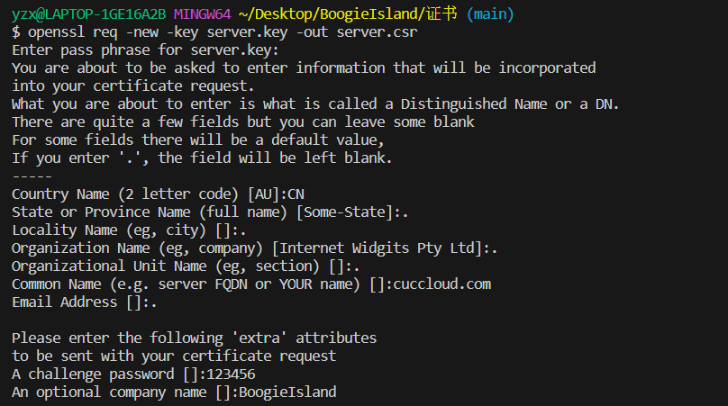
- 新建``v3.ext``文件，粘贴以下内容：
    ```authorityKeyIdentifier=keyid,issuer
    basicConstraints=CA:FALSE
    keyUsage = digitalSignature, nonRepudiation, keyEncipherment, dataEncipherment
    subjectAltName = @alt_names
    [alt_names]
    DNS.1 = example.com
    DNS.2 = www.example.com
    ```
    其中``[alt_names]``需修改为待绑定的域名。
- 通过CA颁发证书：
    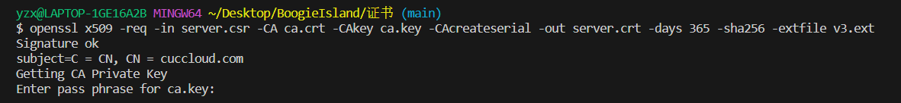

#### 2. 修改hosts文件，添加IP地址与域名的映射

选择``cuccloud.com``作为本项目域名，因此需要建立IP地址（127.0.0.1）和域名（cuccloud.com）的映射。使用**管理员权限**修改hosts文件：
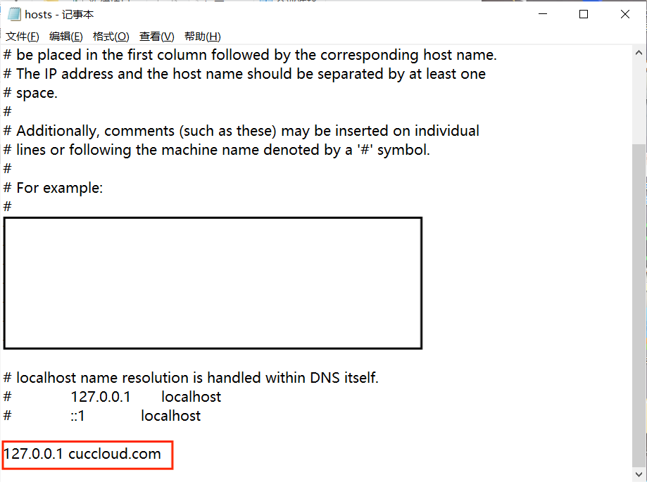

#### 3. 导入根CA证书
- 在``mmc``中导入根CA证书
    - 在cmd命令行输入``mmc``打开管理控制台
    - 在**文件→添加/删除管理单元**选择**证书**，选择计算机账户并确定。
    - 打开证书控制台，选择**受信任的根证书颁发机构**，右键**导入**，将本地生成的**CA证书（CA.crt）**导入。
    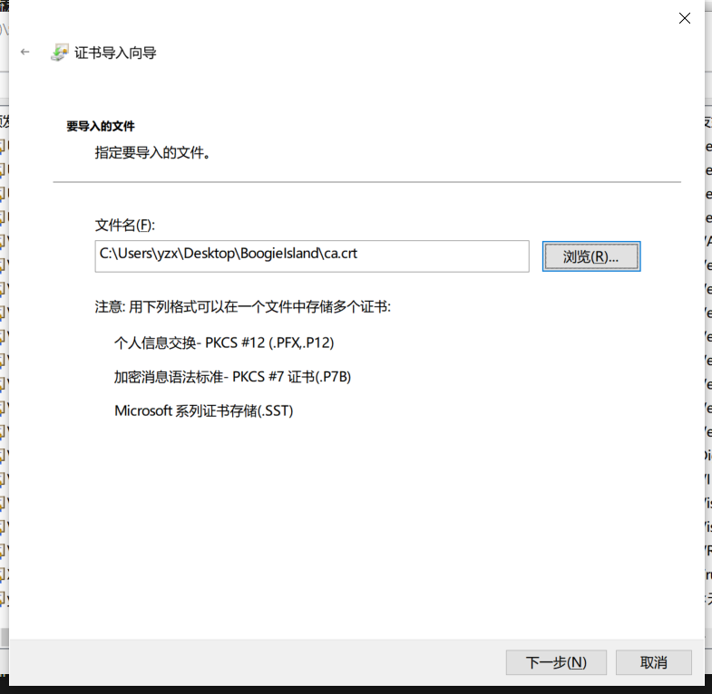
    导入成功后可以查看证书信息：
    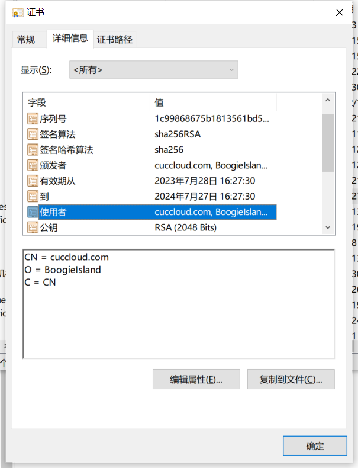

- 在浏览器中导入根CA证书
    - 使用的是Edge浏览器，可以在**设置 → 隐私、搜索和服务 → 安全性 → 管理证书**中添加根CA证书。

#### 4. 在``app.py``中添加证书信息
```
context = ('SERVER_CRT_PATH','SERVER_KEY_PATH') #私钥与证书路径
app.run(host='cuccloud.com',ssl_context=context)
```
使用``python app.py``运行，即可看到域名与证书成功绑定。
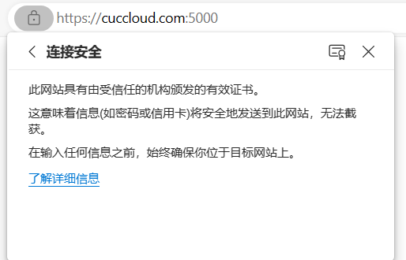

#### 问题解决
- ``app.py``运行报错：``No such file or directory``
    在app.py输入证书和私钥路径时为了方便选择了相对路径，结果在运行时报错``FileNotFoundError: [Errno 2] No such file or directory``。
    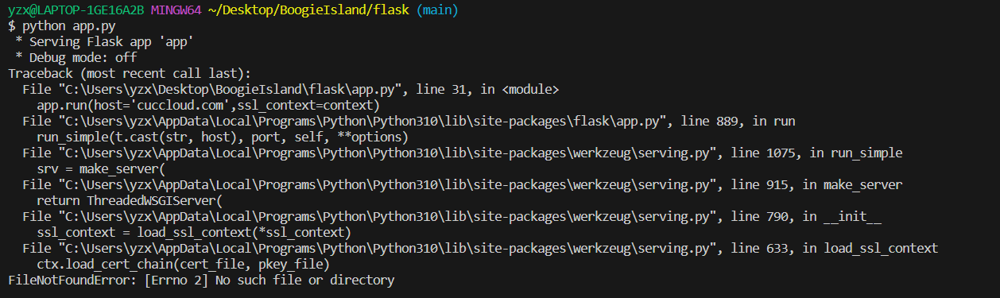
    查询资料后想到替换成绝对路径，尝试后发现可行。
- 最开始的时候不知道要先创建根CA证书，导致直接生成网站证书后发现无法绑定TT感谢热心同学的帮助

#### 参考资料：
- [openSSL命令详解](https://blog.csdn.net/fengyuyeguirenenen/article/details/128936998)
- [通过OpenSSL创建自签名证书在Flask实现HTTPS](https://blog.csdn.net/u010087338/article/details/114271576)
- [错误解决：使用自签名证书运行 Flask 时出错 "No such file or directory"](https://www.coder.work/article/2402716)